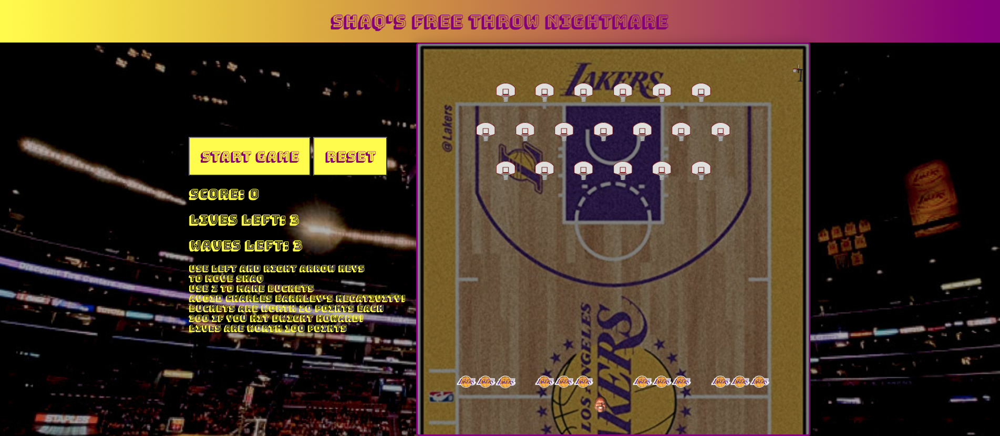
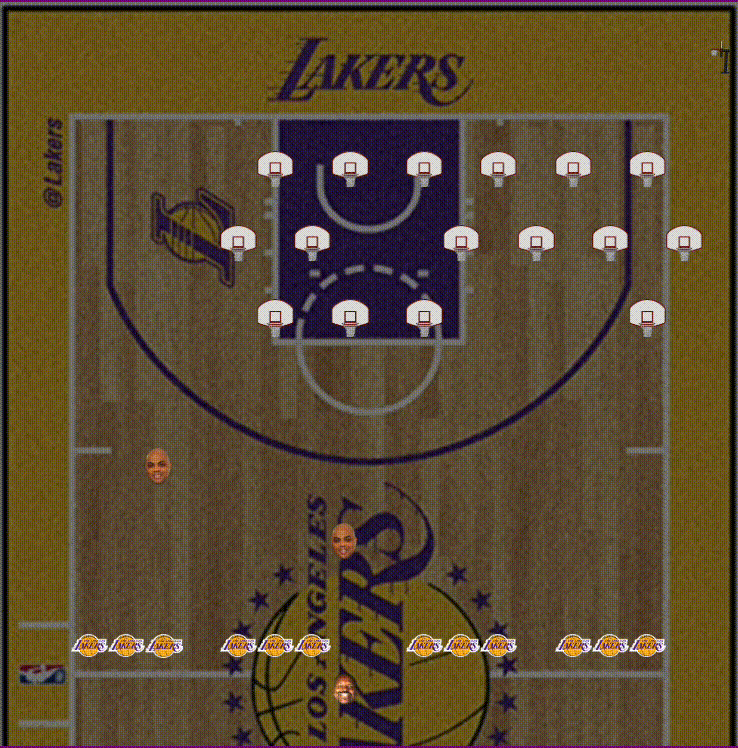
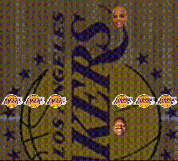

# Project 1

Shaq's Free Throw Nightmare is meant to be a version of Space Invaders. This was a grid based game made primarily as an introduction to **JavaScript**, and is my first project on the General Assembly Software Engineering Immersive course.

**Duration** 7 days.

**Technologies Used** HTML, CSS, JavaScript.

**LINK**

https://jdeering94.github.io/Shaq-s-Free-Throw-Nightmare/

# The Brief

Using HTML, CSS, and JavaScript, recreate an old grid-based arcade game.

For Space Invaders, the minimum requirement was for that:
The player should be able to clear at least one wave of aliens.
The player's score should be displayed at the end of the game.

# Site Overview

<p>

 
</p>
<p align="center">


</p>
 
# Preliminary work
 
I wrote down my minimum requirements for the passable game, as well as the starting points for how I thought I would do each function. I also established a wishlist of features I would implement if I had time.
 
# Day 1
 
With my set of requirements, I started by creating the game grid and adding a spaceship class that could move. To create the grid, I used JavaScript, creating a for loop that created a number of cells based on the width of the grid that I wanted. 
 
```javascript
function createGrid() {
 for (let i = 0; i < gridCellCount; i++) {
   const cell = document.createElement('div');
   if (alienArray.includes(i)) {
     cell.classList.add('alien');
   } else if (logoArray.includes(i)) {
     cell.classList.add('barrier');
   } else if (sideHoopArray.includes(i)) {
     cell.classList.add('sidehoop');
   }
   cell.setAttribute('data-id', i);
   cells.push(cell);
   grid.appendChild(cell);
 }
}
```
 
To add the spaceship, I created my two functions that I would need for movement, addSpaceship and removeSpaceship, and ran the addSpaceship at the beginning of the code. These functions added or removed the class spaceship from cells in my grid. I then needed to write a function that used them in order to simulate movement. I decided to use a switch statement that would incorporate multiple types of keyinputs, as I would need it later in order to make my laser fire. I set two cases for the left and right arrow keys and added my movement functions to them, adding in if statements so that the function wouldn't fire if the spaceship was at either edge of the grid. 
```javascript
function handleKey(event) {
 let x = spaceshipPosition % width;
 if (canMove === true) {
   removeSpaceship();
   switch (event.keyCode) {
     case 39:
       if (x < width - 1) spaceshipPosition++;
       break;
     case 37:
       if (x > 0) spaceshipPosition--;
       break;
     case 90:
       fireLaser();
 
       break;
     default:
       console.log('invalid input');
   }
   addSpaceship();
 } else {
   console.log('start the game');
 }
}
addEventListener('keyup', handleKey);
```
 
I then added a laser fire option to that same handlekey event and started to make my laser function. My approach was to write a function that establishes the source of the laser, and then using setinterval, would increment its position until it hit the top of the grid.
 
# Day 2
 
The goal this day was to create my alien swarm, get them able to be hit by the laser, and get it moving. My swarm was created by adding an array where I would want them to be placed, and passing that array into the createGrid function, so that if any cells matched, they would be given the class 'alien'. I then altered my laser function, adding an if statement for the case of the cell containing both laser and alien, which allowed for the impression of the alien being destroyed. 
```javascript
else if (cells[firePosition].classList.contains('alien')) {
       clearInterval(firingId);
       cells[firePosition].classList.remove('laser');
       cells[firePosition].classList.remove('alien');
       firing = false;
```
I then thought the best way to go about getting the alien swarm moving was to figure out the logic for one, and then refactor the logic to account for multiple aliens. My initial idea was to use arrays and forEach for the multiple case, which proved to be a mistake. Once I got the logic to move one alien, I spent time trying to expand it for multiple cases but couldn't figure out how to.
 
# Day 3
 
The goal was to fix the swarm movement issue. The main issue being that if one alien hit the boundary, that one would move as it should but the rest of them wouldn't match the movement. I realised that if I used for loops instead, I could get the swarm to move all together and that it would all change even if only one alien had hit the boundary. This allowed for the swarm movement to be dynamically adjusted as they were destroyed. 
```javascript
function moveAliens() {
 if (alienArray.length === 0) {
   winScreen();
 } else if (
   alienArray.some((element) => Math.floor(element / width) === width - 2)
 ) {
   alienWin = true;
   gameOver();
 } else if (
   alienArray.some((element) => element % width === width - 1) === true &&
   alienMotion === true
 ) {
   moveDown();
   alienMotion = false;
 } else if (alienMotion === true) {
   moveRight();
   dropBomb();
 } else if (
   alienArray.some((element) => element % width === 0) === true &&
   alienMotion === false
 ) {
   moveDown();
   alienMotion = true;
 } else if (alienMotion === false) {
   moveLeft();
   dropBomb();
 }
}
```
 
I also realised that my laser logic was flawed, and that it not only had to remove the class of the alien, but also to splice that element from the alienArray, otherwise it would reappear after being hit once the swarm moved.
```javascript
       alienArray.splice(alienIndex, 1);
```
 I also added a score that would increment with each alien hit. I then used the same logic for the laser firing to make a function to drop bombs, the function being triggered randomly each time the swarm moved.
```javascript
let bombArray = [];
 
function dropBomb() {
 let chanceOfBomb = Math.floor(Math.random() * 4);
 let bombSource = Math.floor(Math.random() * alienArray.length);
 let bombPosition = alienArray[bombSource];
 
 if (chanceOfBomb === 3) {
   bombsound.src = '../sounds/barkley-turrible.mp3';
   bombsound.play();
   bombArray.push(bombPosition);
   cells[bombPosition].classList.add('alien');
 }
}
setInterval(bombDropping, 350);
 
function bombDropping() {
 for (let i = 0; i < bombArray.length; i++) {
   if (
     cells[bombArray[i]].classList.contains('spaceship') &&
     cells[bombArray[i]].classList.contains('bomb')
   ) {
     cells[bombArray[i]].classList.remove('bomb');
     bombArray.splice(i, 1);
     gameOver();
   } else if (
     cells[bombArray[i]].classList.contains('laser') &&
     cells[bombArray[i]].classList.contains('bomb')
   ) {
     cells[bombArray[i]].classList.remove('bomb');
     cells[bombArray[i]].classList.remove('laser');
     bombArray.splice(i, 1);
   } else if (Math.floor(bombArray[i] / width) === width - 1) {
     cells[bombArray[i]].classList.remove('bomb');
     bombArray.splice(i, 1);
   } else if (
     cells[bombArray[i]].classList.contains('barrier') &&
     cells[bombArray[i]].classList.contains('bomb')
   ) {
     cells[bombArray[i]].classList.remove('barrier');
     cells[bombArray[i]].classList.remove('bomb');
     bombArray.splice(i, 1);
   } else {
     cells[bombArray[i]].classList.remove('bomb');
     bombArray[i] += width;
     cells[bombArray[i]].classList.add('bomb');
   }
 }
}
```
# Day 4
 
I used this day to add win/loss conditions based on the alienArray length, or the spaceship being hit by a bomb, or the aliens reaching the bottom row. 
```javascript
function gameOver() {
 if (lifeArray.length === 0) {
   gameIsLost();
 } else if (alienWin === true) {
   gameIsLost();
 } else {
   loseLife();
 }
}
```
I also styled it somewhat, after I decided to go with the theme of Shaq's Free Throw Nightmare as a concept. The bombs weren't quite behaving as I was hoping they would, but I didn't know what the exact issue was or how to fix it. My progress was also severely hampered by an issue where once I started the game with a button click, when I used the spacebar to fire a laser, it would start the game again, adding another setInterval of alien movement and thus speeding the game up rapidly. I thought it was an issue with nesting functions, but I found out through testing that it was the spacebar that was causing the issue, so I changed the input to the 'z' key. This was finally my MVP.
 
# Day 5
 
With my MVP, I wanted to add more styling to it, and also to add some stretch goals, like a mothership and interaction between bombs and the laser, as well as adding barriers to hide behind. I was able to add the mothership and barriers fine, the barriers the same way I created my alien swarm and the mothership following similar logic to the bombs as it would appear on a random chance and end at a set point. 
```javascript
let motherShipLoop;
let mothershipPresent = false;
let motherPosition;
 
function addMothership() {
 let mothershipCheck = Math.floor(Math.random() * 300);
 if (mothershipCheck === 3 && mothershipPresent === false) {
   mothershipPresent = true;
   motherPosition = width;
   mothershipsound.play();
   motherShipLoop = setInterval(mothershipTravel, 275);
 }
}
function mothershipTravel() {
 if (motherPosition === 2 * width - 2) {
   soundEffect.src =
     '../sounds/mixkit-basketball-ball-hitting-the-net-2084.wav';
   soundEffect.play();
   cells[motherPosition].classList.remove('mothership');
   mothershipPresent = false;
   clearInterval(motherShipLoop);
   mothershipsound.pause();
 } else {
   cells[motherPosition].classList.remove('mothership');
   motherPosition += 1;
   cells[motherPosition].classList.add('mothership');
 }
}
```
It was here I found out my bomb function was badly coded, as when there were multiple bombs onscreen, the interactions with collisions didn't work anymore. My solution was to limit the function to running once, so that there was only one bomb onscreen at a time.
 
# Day 6
 
Spent most of the day adding sound effects that would trigger on certain functions firing, mainly collisions, and also a soundtrack that plays when the game is running. I also added a life counter to the game, a simple array, and also a function that refreshes the alien swarm for a set number of waves, with each eave increasing in speed. I was able to get this working by making the interval speed a variable that I would access everytime the swarm resets, for a total of two resets or three waves. 
```javascript
function newWave() {
 alienArray = [
   44, 46, 48, 50, 52, 54, 83, 85, 87, 89, 91, 93, 95, 124, 126, 128, 130, 132,
   134,
 ];
 alienSpeed -= 250;}
```
I also reworked my bomb function, making use of a bombArray so that there could be multiple on screen. It was a mistake to reuse the laser logic, and in retrospect I should have based it off of the function to move the swarm. Since the logic was there, it was a fairly straghtforward process to change the function to run off of for loops operating on the bombArray, so that the position of each bomb is always known. This approach also fixed all the collision issues I was having and finally I was able to have multiple bombs dropping onscreen and interacting with the different elements of laser, barrier, and spaceship.
 
## Major Hurdles
 
The biggest challenges were working out the swarm movement and collision detection. My initial approach of working out the logic for a single alien and then trying to expand that to multiple aliens was a very flawed approach, it was only when I started using a single array to select the aliens that I was able to get them to behave how I wanted them to. The collision detection was also made easier once I made the switch to arrays, and the project finally came together.
 
## Known Bugs
 
When deployed through github pages, the sound effects for the game don't seem to load or play, but when trying it locally they work. The soundtrack still plays however.
 
Sometimes the collision detection isn't perfect, and a Charles Barkley can pass through a basketball shot at it, I think this is due to the set interval timings.
 
## Wins
 
I was probably happiest with the way the styling and sound effects came through and gave the game the look and personality that I wanted. I was also happy to make it possible to destroy the Charles Barkley heads with basketballs and that there was a barrier system that would be destroyed by the heads as well. The other major win was when I implemented arrays to solve the swarm's movement, as shown below.
 
## Key Learnings
 
My main takeaway from this project was the usefulness of arrays. Although it seemed intuitive to approach a problem from a simple solution and try to build it up, it was much simpler to use arrays, no matter how small the array, since array methods can perform a lot of very useful actions. 
 
### Contact Me
Email: JDeering94@gmail.com

LinkedIn: https://www.linkedin.com/in/joe-deering/

Portfolio: joedeering.co.uk

Feel free to share feedback or if you are aware of any job opportunities please let me know.
